# HandOver

A mobile application for securely managing and conditionally sharing life-critical knowledge with trusted dependents.

## Screenshots

### Authentication
| Login | Register |
|:-----:|:--------:|
| 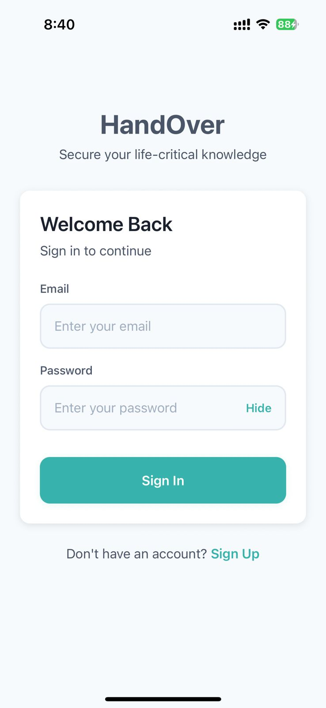 | 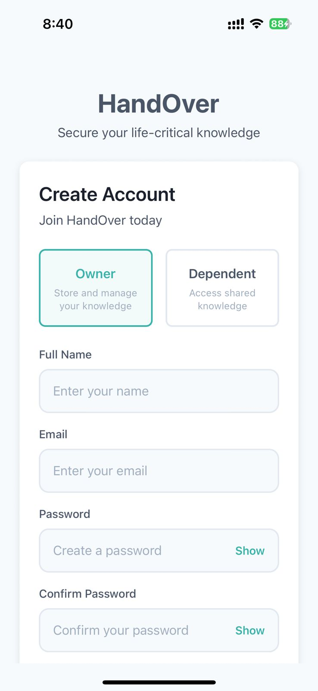 |

### Owner Screens
| Dashboard | Vault Categories | Dependents & Permissions |
|:---------:|:----------------:|:------------------------:|
| 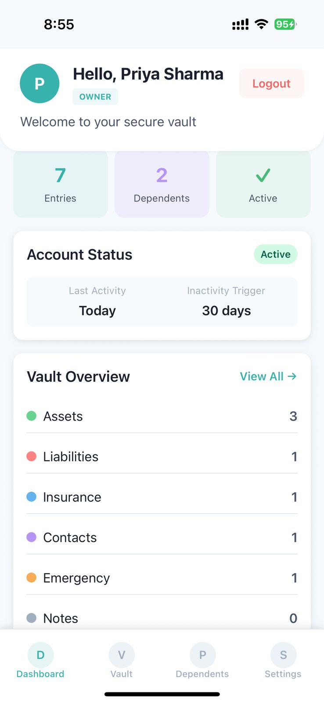 | 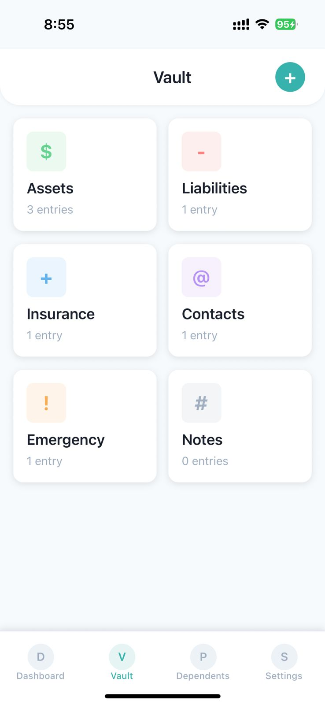 | 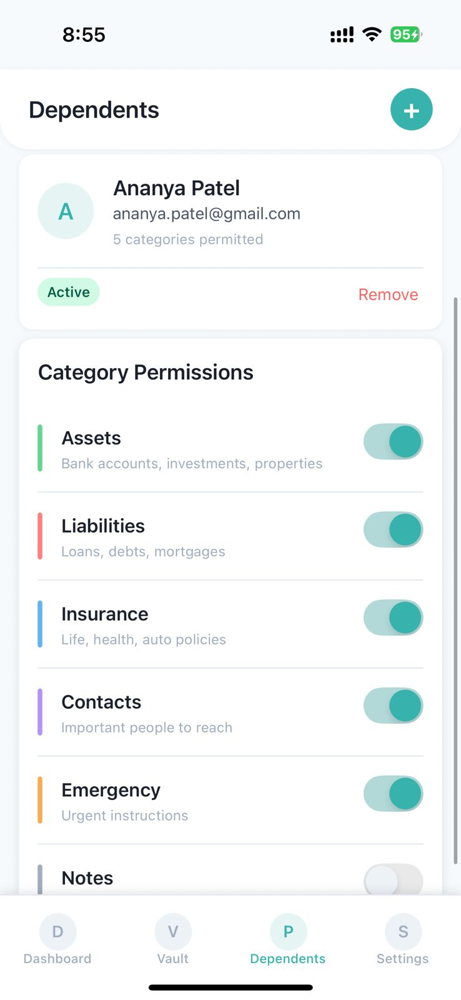 |

| Audit Log |
|:---------:|
| 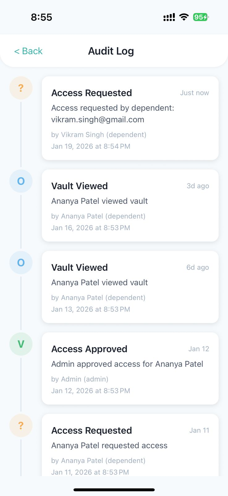 |

### Dependent Screens
| Request Access | Access Status (Pending) | Access Status (History) |
|:--------------:|:-----------------------:|:-----------------------:|
| 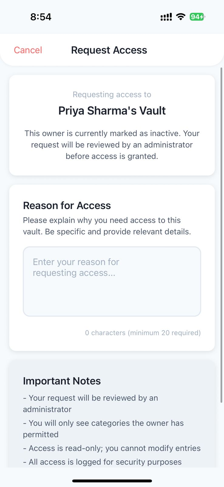 | 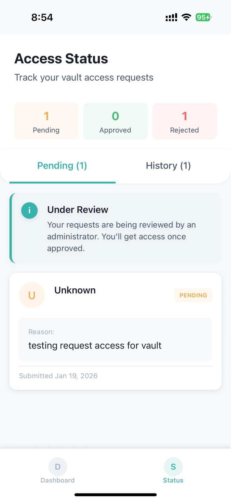 | 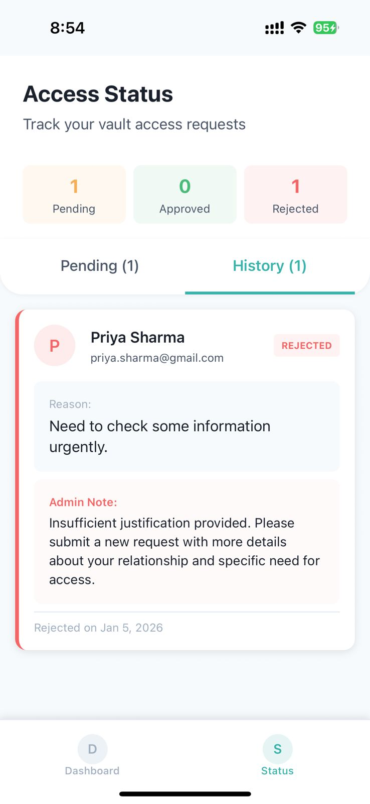 |

### Admin Screens
| Dashboard | Access Requests | All Users |
|:---------:|:---------------:|:---------:|
| 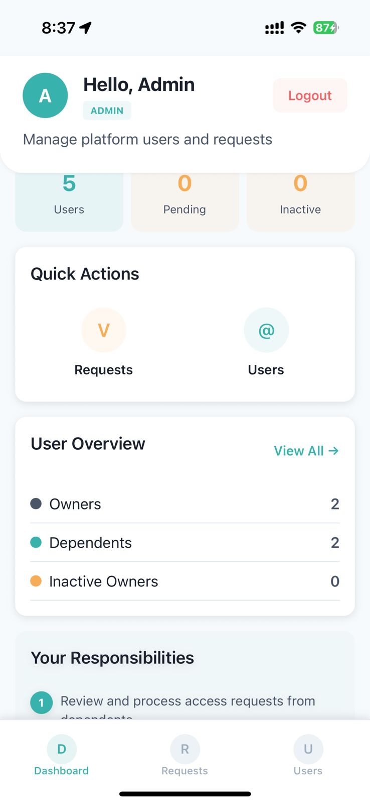 | 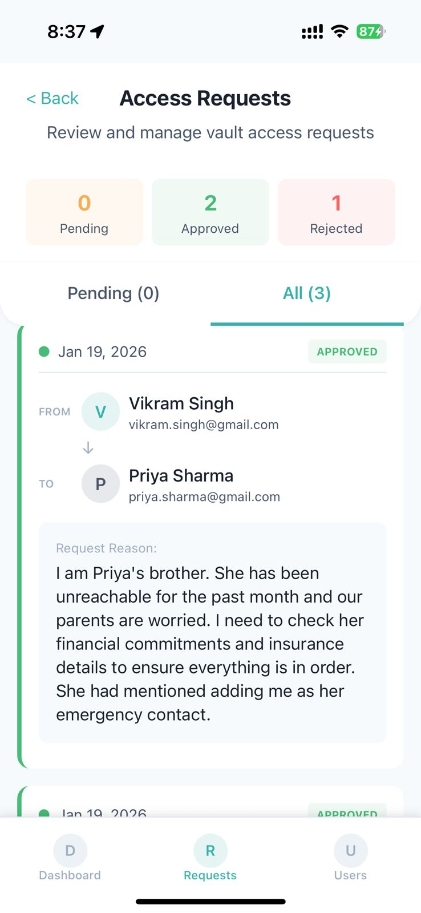 | 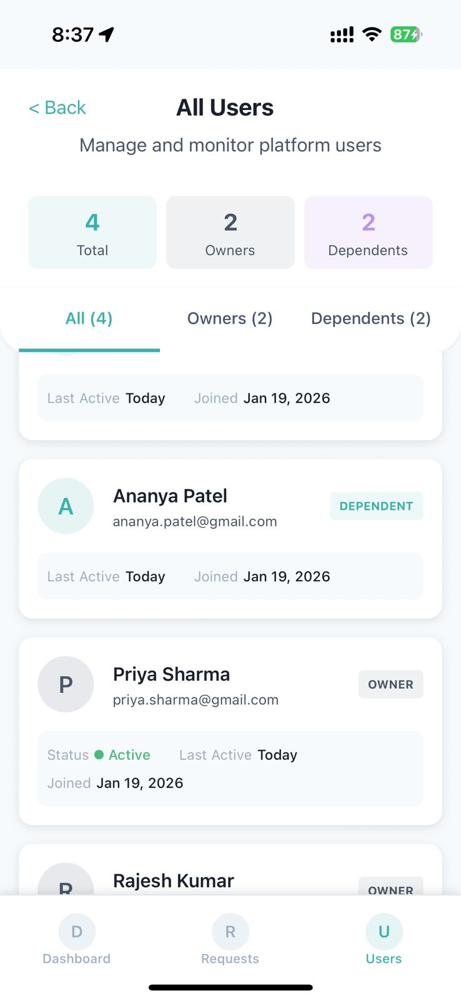 |

---

## Features (PRD)

### Core Features (Implemented)
- ✅ User registration with role selection (Owner/Dependent)
- ✅ JWT-based authentication with secure password hashing
- ✅ Knowledge vault with 6 categories (Assets, Liabilities, Insurance, Contacts, Emergency, Notes)
- ✅ CRUD operations for vault entries
- ✅ Dependent management with granular category permissions
- ✅ Inactivity-based access trigger system (configurable 1-365 days)
- ✅ Access request workflow with reason submission
- ✅ Admin approval/rejection system with notes
- ✅ Comprehensive audit logging
- ✅ Role-based navigation and access control
- ✅ Read-only vault viewing for approved dependents

### Future Enhancements
- 🔮 Push notifications for access requests and approvals
- 🔮 Biometric authentication (fingerprint/face)
- 🔮 Document/image attachments in vault entries
- 🔮 Multiple admin support
- 🔮 Email notifications
- 🔮 Data export functionality

---

## The Problem

When someone becomes incapacitated, hospitalized, or passes away, their loved ones often struggle to access critical information like:
- Bank account details
- Insurance policies
- Important contacts
- Medical information
- Loan/liability details
- Personal wishes

**HandOver solves this** by providing a secure digital vault that automatically becomes accessible to trusted people when the owner becomes inactive.

## How It Works

### The Core Concept

```
┌─────────────────────────────────────────────────────────────────┐
│                         HANDOVER FLOW                           │
├─────────────────────────────────────────────────────────────────┤
│                                                                 │
│   OWNER                    DEPENDENT                 ADMIN      │
│     │                          │                       │        │
│     │ 1. Creates vault         │                       │        │
│     │ 2. Adds dependents       │                       │        │
│     │ 3. Sets permissions      │                       │        │
│     │                          │                       │        │
│     │──── Becomes Inactive ────│                       │        │
│     │    (30+ days no login)   │                       │        │
│     │                          │                       │        │
│     │                    4. Requests access            │        │
│     │                          │───────────────────────│        │
│     │                          │                       │        │
│     │                          │              5. Reviews request │
│     │                          │              6. Approves/Rejects│
│     │                          │                       │        │
│     │                          │◄──────────────────────│        │
│     │                    7. Views vault (if approved)  │        │
│                                                                 │
└─────────────────────────────────────────────────────────────────┘
```

## User Roles Explained

### 1. Owner (Vault Creator)

The Owner is someone who wants to store their critical information and share it with trusted people in case of emergency.

**What an Owner can do:**
- Create a secure knowledge vault with 6 categories
- Add trusted people (dependents) who can access their vault
- Set specific permissions (which categories each dependent can see)
- Configure inactivity period (how many days before being marked inactive)
- View audit logs of who accessed their vault

**Owner's Screens:**
| Screen | Purpose |
|--------|---------|
| Dashboard | Overview of vault stats, dependents count, activity status |
| Vault | View all entries organized by 6 categories |
| Add Entry | Create new vault entry with title and content |
| Edit Entry | Modify or delete existing entries |
| Dependents | List of people who can access vault when inactive |
| Add Dependent | Add a dependent by their email address |
| Settings | Update profile, set inactivity days (1-365) |
| Audit Log | Timeline of all vault activity |

### 2. Dependent (Vault Accessor)

The Dependent is someone who has been designated by an Owner to access their vault in case of emergency.

**What a Dependent can do:**
- See list of owners who added them as dependent
- See which owners are currently active or inactive
- Request access to an inactive owner's vault
- View approved vault entries (read-only)
- Track status of their access requests

**Dependent's Screens:**
| Screen | Purpose |
|--------|---------|
| Dashboard | List of owners who added you, their status (Active/Inactive) |
| Access Status | Track your access requests (Pending/Approved/Rejected) |
| Request Access | Submit request with reason when owner is inactive |
| View Vault | Read-only view of permitted categories (after approval) |

### 3. Admin (Platform Manager)

The Admin verifies and approves access requests to ensure security.

**What an Admin can do:**
- View all pending access requests
- Review request details (who is requesting, whose vault, reason)
- Approve or reject requests with notes
- Monitor all platform users
- View user statistics

**Admin's Screens:**
| Screen | Purpose |
|--------|---------|
| Dashboard | Overview stats, pending requests alert, quick actions |
| Pending Requests | List of all access requests with approve/reject buttons |
| All Users | List of all owners and dependents on the platform |

## Detailed Process Flows

### Process 1: Owner Sets Up Vault

```
Step 1: Register
├── Open app → Tap "Sign Up"
├── Enter name, email, password
├── Select role: "Owner"
└── Account created, redirected to Owner Dashboard

Step 2: Add Vault Entries
├── Go to Vault tab
├── Tap "+" button
├── Select category (Assets/Liabilities/Insurance/Contacts/Emergency/Notes)
├── Enter title and content
└── Save entry

Step 3: Add Dependents
├── Go to Dependents tab
├── Tap "+" or "Add Dependent"
├── Enter dependent's email (must be registered as Dependent)
├── Select permissions (which categories they can access)
└── Dependent is now linked

Step 4: Configure Inactivity
├── Go to Settings tab
├── Set "Inactivity Trigger" (default: 30 days)
├── This is how long before you're marked inactive
└── Save settings
```

### Process 2: Dependent Requests Access

```
Step 1: Register as Dependent
├── Open app → Tap "Sign Up"
├── Enter name, email, password
├── Select role: "Dependent"
└── Account created, redirected to Dependent Dashboard

Step 2: Wait to be Added
├── Dashboard shows "No Owners Yet"
├── Owner must add you using your email
└── Once added, owner appears in your list

Step 3: Owner Becomes Inactive
├── Owner doesn't login for 30+ days (or their configured period)
├── System marks owner as "Inactive"
├── Owner's status changes from "Active" to "Inactive" in your dashboard
└── "REQUEST" button becomes available

Step 4: Request Access
├── Tap on inactive owner → "Request Access"
├── Enter reason for requesting access
├── Submit request
└── Status changes to "Pending"

Step 5: Wait for Admin Approval
├── Admin reviews your request
├── You can check status in "Access Status" screen
├── Status will change to "Approved" or "Rejected"
└── If rejected, you can submit a new request with more details
```

### Process 3: Admin Approves Request

```
Step 1: Login as Admin
├── Use admin credentials
└── Redirected to Admin Dashboard

Step 2: Review Pending Requests
├── Dashboard shows pending count
├── Tap "Pending Requests" or the alert card
└── See list of all pending requests

Step 3: Review Request Details
├── See who is requesting (Dependent name)
├── See whose vault (Owner name)
├── Read the reason provided
└── Check if owner is truly inactive

Step 4: Make Decision
├── Tap "Approve" → Add optional note → Confirm
│   └── Dependent can now view vault
├── Tap "Reject" → Add reason → Confirm
│   └── Dependent notified, can resubmit
└── Request moves to history
```

### Process 4: Dependent Views Vault

```
After Approval:
├── Dependent's dashboard shows owner with "VIEW" button
├── Tap owner → Opens View Vault screen
├── See only permitted categories (based on owner's settings)
├── Entries are read-only (cannot edit or delete)
└── All access is logged in owner's audit trail
```

## Vault Categories

| Category | What to Store | Icon Color |
|----------|---------------|------------|
| **Assets** | Bank accounts, investments, property details, FDs, stocks | Green |
| **Liabilities** | Loans, EMIs, credit cards, debts | Red |
| **Insurance** | Life insurance, health insurance, vehicle insurance | Blue |
| **Contacts** | Lawyer, CA, doctor, financial advisor, emergency contacts | Purple |
| **Emergency** | Medical info, blood type, allergies, medications | Orange |
| **Notes** | Personal wishes, instructions, messages, passwords | Gray |

## Inactivity System

The inactivity system is the core security feature:

1. **Activity Tracking**: Every time an owner logs in, their "last activity" timestamp updates
2. **Inactivity Check**: System compares last activity with current time
3. **Inactivity Trigger**: If (current time - last activity) > inactivity days, owner is marked inactive
4. **Access Unlock**: Only when owner is inactive can dependents request access

**Example:**
- Owner sets inactivity to 30 days
- Owner last logged in on Jan 1
- On Jan 31 (30 days later), owner becomes "Inactive"
- Dependents can now request access
- If owner logs in on Feb 5, they become "Active" again

## Permission System

Owners have granular control over what each dependent can see:

```
Owner: Rajesh Kumar
├── Dependent: Ananya (Wife)
│   ├── Assets: ✓
│   ├── Liabilities: ✓
│   ├── Insurance: ✓
│   ├── Contacts: ✓
│   ├── Emergency: ✓
│   └── Notes: ✓ (Full access)
│
└── Dependent: Vikram (Brother)
    ├── Assets: ✗
    ├── Liabilities: ✗
    ├── Insurance: ✓
    ├── Contacts: ✓
    ├── Emergency: ✓
    └── Notes: ✗ (Limited access)
```

## Tech Stack

| Layer | Technology |
|-------|------------|
| Mobile App | React Native (Expo) + TypeScript |
| Navigation | React Navigation (Stack + Bottom Tabs) |
| State | React Context API |
| Backend | Node.js + Express.js |
| Database | MongoDB (Atlas) |
| Auth | JWT + bcrypt |

## Project Structure

```
HandOver/
├── frontend/                   # React Native Expo app
│   ├── context/               # State management (Auth, Vault, Dependent, Access)
│   ├── navigation/            # App navigation (role-based routing)
│   ├── screens/
│   │   ├── auth/             # Login, Register
│   │   ├── owner/            # Dashboard, Vault, Dependents, Settings, etc.
│   │   ├── dependent/        # Dashboard, RequestAccess, ViewVault, Status
│   │   └── admin/            # Dashboard, PendingRequests, AllUsers
│   ├── components/common/    # Reusable UI components
│   ├── theme/                # Colors, typography, spacing
│   └── utils/                # API client, helpers
│
├── backend/                   # Express.js server
│   ├── models/               # MongoDB schemas (User, KnowledgeEntry, etc.)
│   ├── routes/               # API endpoints
│   └── middleware/           # Auth middleware
```

## Getting Started

### Prerequisites
- Node.js v16+
- MongoDB database (local or Atlas)
- Expo CLI (`npm install -g expo-cli`)

### Backend Setup

```bash
cd backend
npm install
```

Create a `.env` file:
```
PORT=5000
MONGODB_URI=your_mongodb_connection_string
JWT_SECRET=your_secret_key
```

Start the server:
```bash
npm start
```

### Frontend Setup

```bash
cd frontend
npm install
```

For mobile device testing, update the API URL in `utils/api.ts` with your computer's IP address.

Start the app:
```bash
npx expo start
```

- Press `i` for iOS Simulator
- Press `a` for Android Emulator
- Press `w` for Web Browser
- Scan QR code with Expo Go app

## Demo Video

[Watch Demo Video](https://drive.google.com/file/d/1o4ouxJFm9RJyyupZrEOTHgQFNWvFSjyU/view?usp=drivesdk)

<!-- Add your demo video link above -->

## API Reference

### Authentication
| Endpoint | Method | Description |
|----------|--------|-------------|
| `/api/auth/register` | POST | Create new account |
| `/api/auth/login` | POST | Sign in |
| `/api/auth/me` | GET | Get current user |
| `/api/auth/activity` | POST | Update activity timestamp |

### Vault
| Endpoint | Method | Description |
|----------|--------|-------------|
| `/api/vault` | GET | List all entries |
| `/api/vault` | POST | Create entry |
| `/api/vault/:id` | GET | Get entry details |
| `/api/vault/:id` | PUT | Update entry |
| `/api/vault/:id` | DELETE | Remove entry |
| `/api/vault/stats` | GET | Category statistics |

### Dependents
| Endpoint | Method | Description |
|----------|--------|-------------|
| `/api/dependents` | GET | List dependents |
| `/api/dependents` | POST | Add dependent |
| `/api/dependents/:id` | PUT | Update permissions |
| `/api/dependents/:id` | DELETE | Remove dependent |
| `/api/dependents/owners` | GET | List owners (dependent view) |

### Access Requests
| Endpoint | Method | Description |
|----------|--------|-------------|
| `/api/access/request` | POST | Submit access request |
| `/api/access/my-requests` | GET | View my requests |
| `/api/access/pending` | GET | Pending requests (admin) |
| `/api/access/all` | GET | All requests (admin) |
| `/api/access/:id/approve` | POST | Approve request (admin) |
| `/api/access/:id/reject` | POST | Reject request (admin) |
| `/api/access/vault/:ownerId` | GET | View permitted vault |
| `/api/access/logs` | GET | Access audit logs |

### Users (Admin)
| Endpoint | Method | Description |
|----------|--------|-------------|
| `/api/users` | GET | All users |
| `/api/users/stats` | GET | User statistics |

## Security Features

1. **Password Hashing**: bcrypt with salt rounds
2. **JWT Authentication**: Secure token-based auth
3. **Role-Based Access**: Different permissions per role
4. **Inactivity Protection**: Access only when owner is inactive
5. **Admin Verification**: Human approval required for access
6. **Audit Logging**: All actions are tracked
7. **Granular Permissions**: Category-level access control

## Author

Ruthwik Chikoti

## License

Educational project for React Native / Mobile Application Development course.
